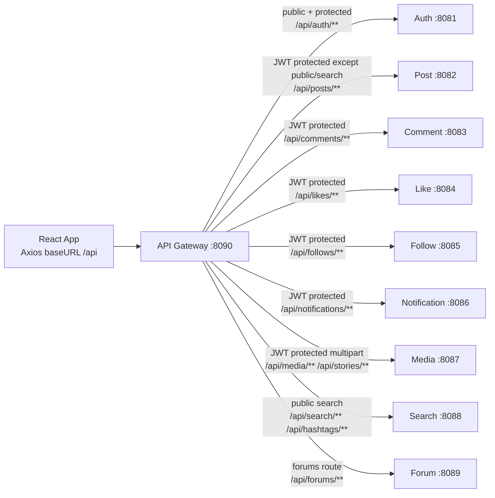
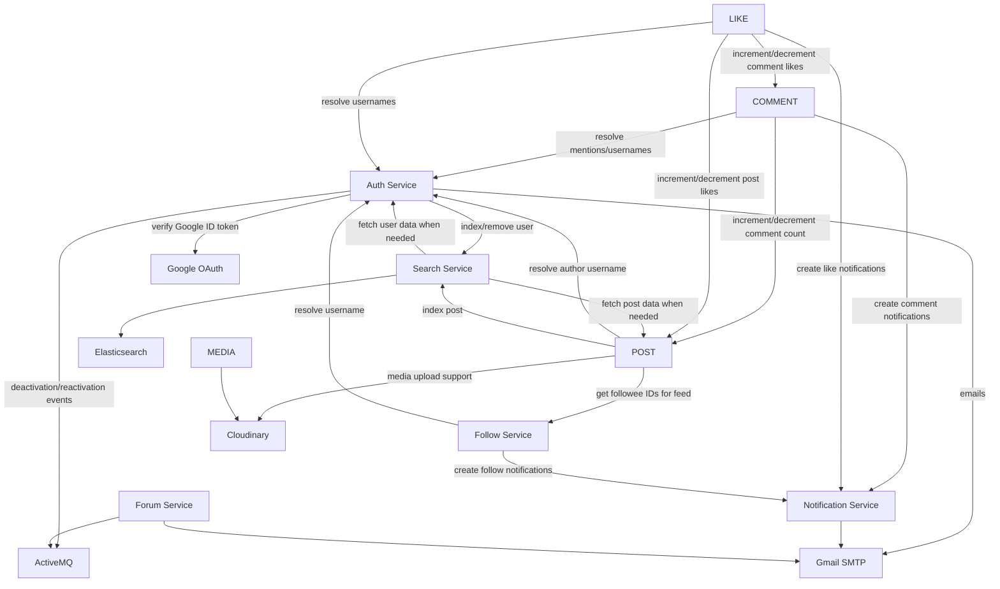
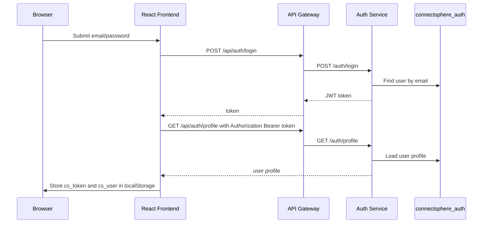
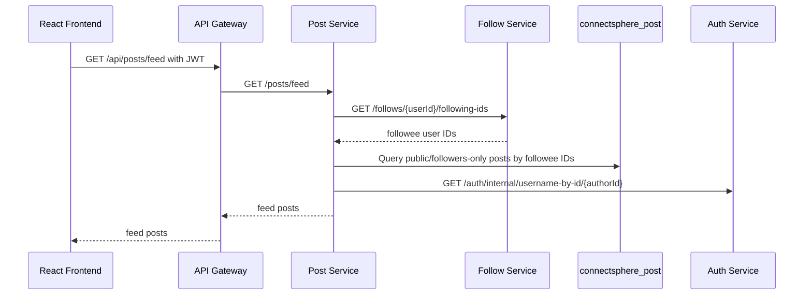
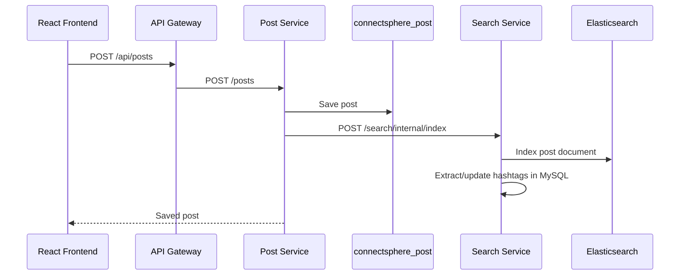
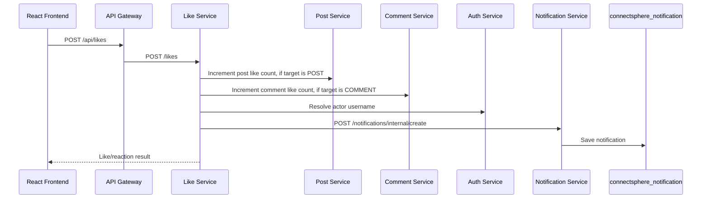

# ConnectSphere Architecture

This document maps the current project from React frontend to API gateway, backend microservices, databases, search, media storage, messaging, and email.

## High-Level System Diagram

```mermaid
flowchart TB
    U[User Browser]
    FE[React Frontend<br/>connectsphere-frontend<br/>Vite dev server :3000]
    GW[Spring Cloud API Gateway<br/>api-gateway :8090<br/>CORS + JWT filter + route proxy]

    U --> FE
    FE -->|/api/* via Vite proxy| GW

    subgraph Backend["Spring Boot Microservices"]
        AUTH[Auth Service :8081<br/>users, login, JWT, OAuth, profile, admin users]
        POST[Post Service :8082<br/>posts, feed, counters, visibility]
        COMMENT[Comment Service :8083<br/>comments, threaded replies]
        LIKE[Like Service :8084<br/>likes + reactions]
        FOLLOW[Follow Service :8085<br/>followers, following, suggestions]
        NOTIF[Notification Service :8086<br/>notifications + broadcast]
        MEDIA[Media Service :8087<br/>uploads, media, stories]
        SEARCH[Search Service :8088<br/>post/user search, hashtags, trending]
        FORUM[Forum Service :8089<br/>forums, posts, moderators, bans]
    end

    GW -->|/api/auth/**| AUTH
    GW -->|/api/posts/**| POST
    GW -->|/api/comments/**| COMMENT
    GW -->|/api/likes/**| LIKE
    GW -->|/api/follows/**| FOLLOW
    GW -->|/api/notifications/**| NOTIF
    GW -->|/api/media/**, /api/stories/**| MEDIA
    GW -->|/api/search/**, /api/hashtags/**| SEARCH
    GW -->|/api/forums/**| FORUM

    subgraph MySQL["MySQL :3306 - Database per Service"]
        DB_AUTH[(connectsphere_auth<br/>users)]
        DB_POST[(connectsphere_post<br/>posts, post_media_urls)]
        DB_COMMENT[(connectsphere_comment<br/>comments)]
        DB_LIKE[(connectsphere_like<br/>likes)]
        DB_FOLLOW[(connectsphere_follow<br/>follows)]
        DB_NOTIF[(connectsphere_notification<br/>notifications)]
        DB_MEDIA[(connectsphere_media<br/>media, stories)]
        DB_SEARCH[(connectsphere_search<br/>hashtags, post_hashtags)]
        DB_FORUM[(connectsphere_forum<br/>forums, forum_posts,<br/>forum_moderators, forum_bans)]
    end

    AUTH --> DB_AUTH
    POST --> DB_POST
    COMMENT --> DB_COMMENT
    LIKE --> DB_LIKE
    FOLLOW --> DB_FOLLOW
    NOTIF --> DB_NOTIF
    MEDIA --> DB_MEDIA
    SEARCH --> DB_SEARCH
    FORUM --> DB_FORUM

    ES[(Elasticsearch :9200<br/>indexes: posts, users)]
    CLOUD[(Cloudinary<br/>image/file storage)]
    MQ[(ActiveMQ :61616<br/>account.deactivation, forum.mail)]
    SMTP[(Gmail SMTP :587)]
    GOOGLE[Google OAuth<br/>tokeninfo API]

    SEARCH --> ES
    MEDIA --> CLOUD
    POST --> CLOUD
    AUTH --> MQ
    FORUM --> MQ
    AUTH --> SMTP
    NOTIF --> SMTP
    FORUM --> SMTP
    AUTH --> GOOGLE
```

## Gateway Routing

Public gateway paths include registration, login, Google OAuth, token validation/refresh, public posts, search, hashtags, forum listing, comment-by-post, and Swagger docs. Protected routes use the gateway `JwtAuthFilter` and the shared JWT secret configured across services.

## Service Ownership

| Service | Port | Main API Area | Own Database / Tables | Important External Integrations |
|---|---:|---|---|---|
| Frontend | 3000 | React pages/components, Axios API layer | Browser localStorage for JWT/user | Vite proxy to gateway |
| API Gateway | 8090 | `/api/*` routing, CORS, JWT filter, Swagger aggregation | none | Routes to all services |
| Auth | 8081 | `/auth` register/login/profile/admin/internal | `connectsphere_auth.users` | Google OAuth, Search, ActiveMQ, Gmail SMTP |
| Post | 8082 | `/posts` CRUD/feed/public/admin/internal counters | `connectsphere_post.posts`, `post_media_urls` | Follow, Auth, Search, Cloudinary |
| Comment | 8083 | `/comments` comments/replies/threaded/internal counters | `connectsphere_comment.comments` | Post, Auth, Notification |
| Like | 8084 | `/likes` like/unlike/reaction/summary | `connectsphere_like.likes` | Post, Comment, Auth, Notification |
| Follow | 8085 | `/follows` follow/unfollow/counts/suggested | `connectsphere_follow.follows` | Auth, Notification |
| Notification | 8086 | `/notifications` create/read/bulk | `connectsphere_notification.notifications` | Gmail SMTP |
| Media | 8087 | `/media`, `/stories` upload/story feed/story views | `connectsphere_media.media`, `stories` | Cloudinary |
| Search | 8088 | `/search`, `/hashtags`, internal indexing | `connectsphere_search.hashtags`, `post_hashtags` | Elasticsearch, Post, Auth |
| Forum | 8089 | `/forums` forum posts/moderators/bans/admin | `connectsphere_forum.*` | ActiveMQ, Gmail SMTP |

## Inter-Service Communication

## Main User Flows

### Login / Authenticated API Calls

### Feed Loading

### Create Post and Search Indexing

### Like / Comment Notification Flow

## Technology Stack

- Frontend: React 18, Vite, React Router, Axios, Tailwind CSS, React Icons, React Hot Toast, Jest + React Testing Library.
- Gateway: Spring Cloud Gateway, JWT route filter, CORS, Swagger aggregation.
- Backend services: Spring Boot 3.2, Spring Web, Spring Data JPA, Spring Security, Bean Validation, Lombok.
- Databases: MySQL with one schema per service.
- Search: Elasticsearch 8.x plus MySQL hashtag metadata.
- Messaging: ActiveMQ for account deactivation and forum mail queues.
- Media storage: Cloudinary.
- Email: Gmail SMTP.
- Auth: JWT shared secret across services, plus Google OAuth login.

## How to View This Diagram

Most Markdown viewers that support Mermaid can render this file directly. In VS Code, install a Mermaid Markdown preview extension, then open `ARCHITECTURE.md` and use Markdown Preview.

You can also paste any Mermaid block into https://mermaid.live to render/export PNG or SVG.
